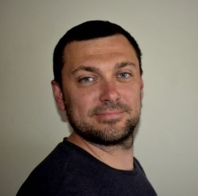
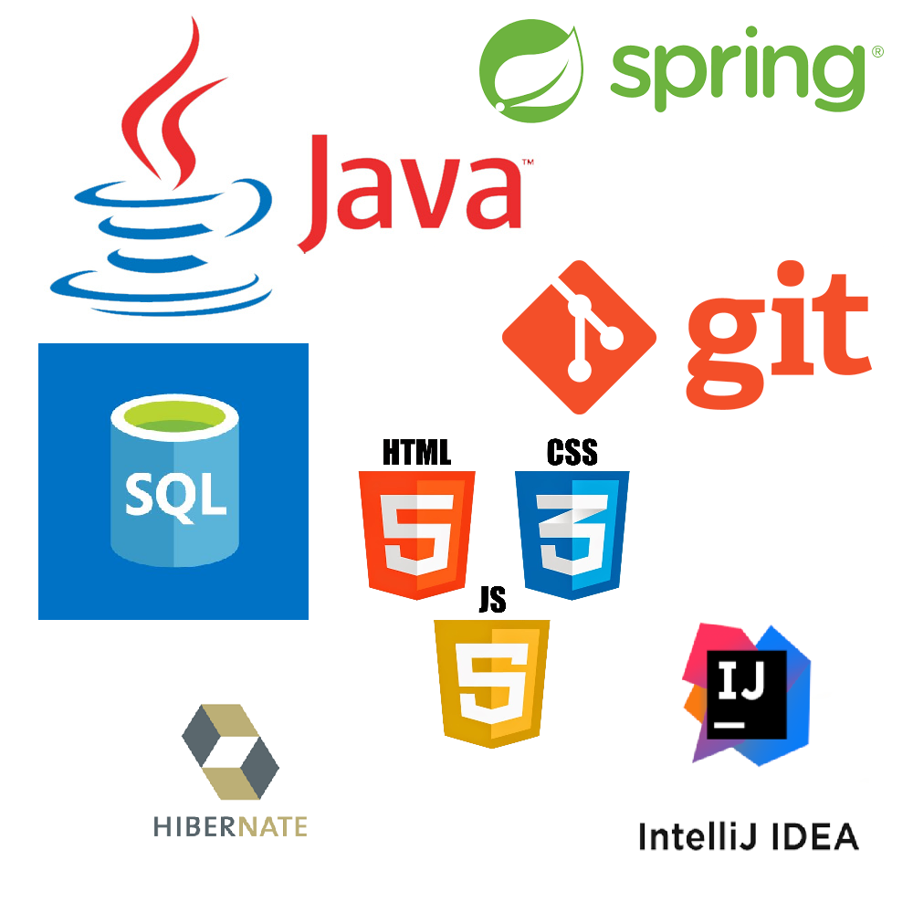

# Marcin Sroczyński

## O mnie
Cześć, nazywam się Marcin Sroczyński, jestem początkującym programistą, w tym miejscu chciałbym podzielić się z Tobą moim doświadczeniem oraz projektami, które miałem dotychczas przyjemność wykonać. 

 

  

## Programowanie
 Zawsze lubiłem rozwiązywać problemy oraz ułatwiać sobie powtarzalne czynności. Moim zdaniem programowanie to jedno z wyjątkowych narzędzi, które pozwala sprawić, że nasze życie staje się przyjemniejsze. Po wielu latach pracy w branży logistycznej, postanowiłem spróbować swoich sił w programowaniu , zgłębiając podstawy języka Java, by nastepnie pod okiem mentorów w Software Development Academy skupić sie na rozwoju w kierunku developera języka Java.
 
## Kurs Software Development Academy
Miałem przyjemność uczestniczyć w kursie "Java od Podstaw" organizowanym przez Software Development Academy. Przez ponad 350 godzin zajęć oraz wiele godzin poświęconych na pracę samodzielną zdobyłem wiedzę z następujacych tematów:

## Git oraz HTTP
W czasie kursu nauczyłem się nie tylko programować, ale rozwijałem swoje umiejętności w wielu kierunkach między innymi:

* Nauczyłem się pracy z Narzędziem GIT (oraz Github)

* Nauczyłem się podstaw REST API oraz narzędzi sieciowych, dzięki czemu w przyszłej pracy, będę mógł stanowić wsparcie w czasie procesu debugowania back-end'u.

## Testowanie Oprogramowania
Wiem, że współczesne projekty powinny się charakteryzować nie tylko dobrze zaprojektowaną, skalowalną oraz łatwo utrzymywalną archiekturą ale także powinny być 
odpowiednio przetestowane na poziomie testów jednostkowych oraz integracyjnych. Nauczyłem się testować własny kod, dzięki czemu zaoszczedziło mi to sporo czasu 
w czasie rozwijania moich projektów.

## Zadania, które wykonywałem w czasie kursu:

[Podstawy Java](Podstawy Java) | [Testowanie Oprogramowania](Testowanie Oprogramowania) | [Wzorce Projektowe](Wzorce Projektowe) |
[JDBC Hibernate](JDBC Hibernate) | [Technologie Frontendowe](Technologie Frontendowe) | [Spring](Spring) |
[Bazy Danych oraz SQL](Bazy Danych oraz SQL)

  
## Moje projekty

* New Bins Rotation

* Stacja Pogody Hibernate

* Rent A Room By The Sea

* Ristorante

* Training With API (Sample With Angular)
  
* Resume (HTML)

## Technologie

  ## Zainteresowania
  
Programowanie to nie wszystko, w wolnym czasie eksploruję polsko-czeskie Karkonosze .

  
## Kontakt

Skontaktuj się ze mną mailowo: sroko1marcin@o2.pl

Linkedin: [Marcin Sroczyński](https://www.linkedin.com/in/marcin-sroczy%C5%84ski-194252215/)

  
